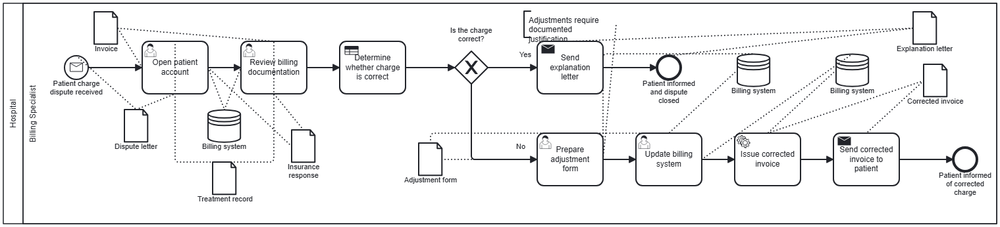
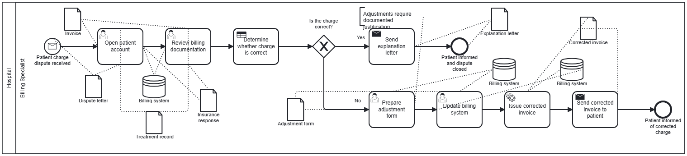
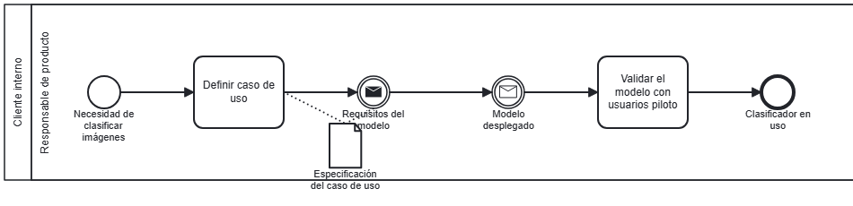
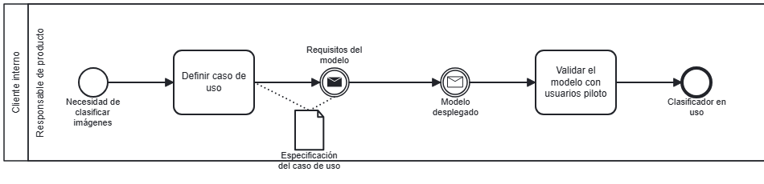
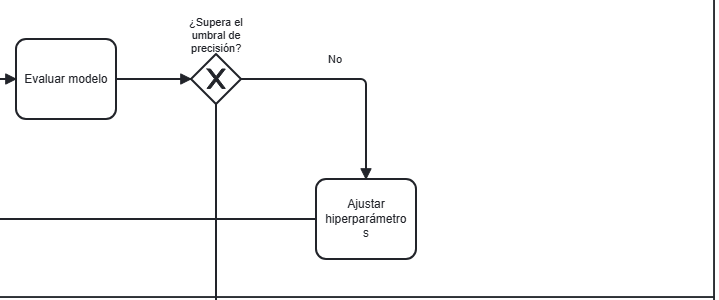
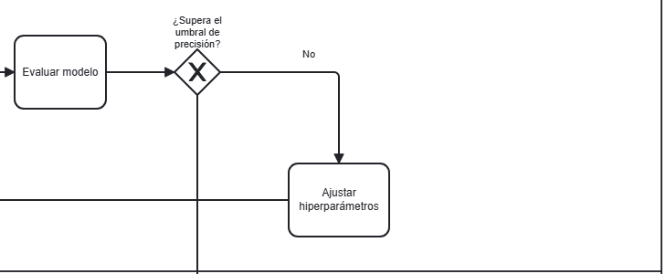
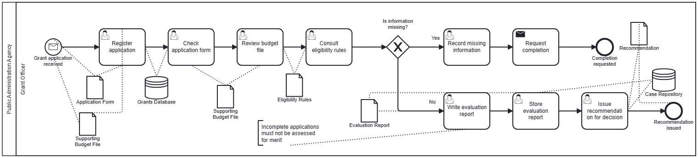
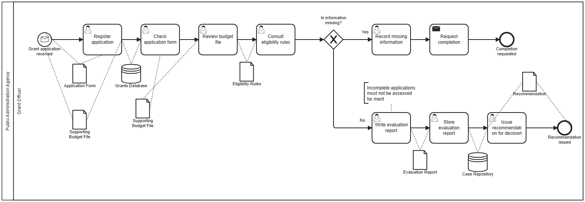
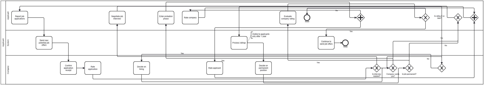
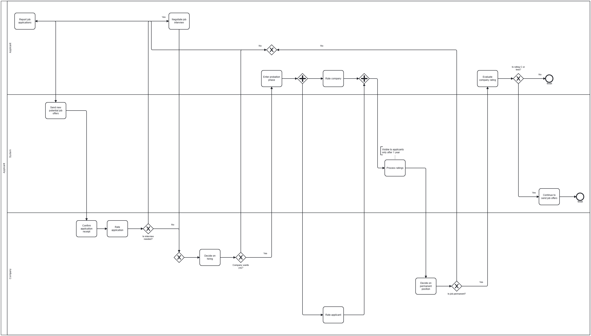

# Candidatos v8–v12: resumen para revisar (2026-09-26)

Trabajo autónomo durante la ausencia del usuario, con su autorización. Cada propuesta de `evidence/layout-review-20260926/REVIEW.md` es un candidato independiente sobre v7 (el layout por defecto, que no ha cambiado), para poder votarlos por separado. Todo local, sin modelos; XML semántico idéntico en los 56 casos de todos; v0 intacto; commits locales sin push.

| Candidato | Propuesta | Casos que cambian | Filtro objetivo | Lo más destacado | Informe |
| --- | --- | --- | --- | --- | --- |
| v8 | C, artefactos con alcance limitado | 5 | No (1 etiqueta cruzada más) | asociaciones largas 41 → 39 | `evidence/layout-v8/REPORT.md` |
| v9 | G, etiquetas de eventos encima | 7 | **Sí** | etiquetas sobre formas 16 → 14, cruzadas 174 → 168 | `evidence/layout-v9/REPORT.md` |
| v10 | D, ancho de tarea según la palabra | 11 | **Sí** | ninguna palabra partida | `evidence/layout-v10/REPORT.md` |
| v11 | B, hacer sitio a los artefactos | 10 | No (área +23 a +52 % en 4) | etiquetas sobre formas 16 → 8, texto cortado 5 → 2, cruces 351 → 327, asociaciones largas 41 → 27 | `evidence/layout-v11/REPORT.md` |
| v12 | A, gateways junto a su tarea | 7 | No (`find-a-job` +200 % de área) | cruces 351 → 262 (secuencia 135 → 55) | `evidence/layout-v12/REPORT.md` |
| v13 | Claridad de flujos (notas del usuario sobre v12) | 4 | No (`find-a-job` con la base de v7) | caras mixtas y solapes ambiguos a 0; también con v12 + v13 | `evidence/layout-v13/REPORT.md` |

Los filtros que fallan son de área o de una etiqueta. En v11 y v12 crecer es parte de la idea; que compense lo decide el voto.

## Antes (v7) y después

**v8**, `c-syn012-chatgpt`: «Explanation letter» vuelve junto a su tarea.




**v9**, `h-ml-01`: «Requisitos del modelo» sube y la asociación ya no la tacha.




**v10**, `h-ml-01`: «hiperparámetros» entero.




**v11**, `c-syn011-chatgpt`: cada artefacto junto a su tarea, sin líneas que crucen el diagrama.




**v12**, `find-a-job`: el flujo se lee de izquierda a derecha; los carriles quedan altos.




## Votar

Cinco lotes, 41 parejas en total (A = v7, B = candidato; orden ciego). Uno tras otro, cada página se abre al terminar la anterior:

Desde la raíz del repositorio (`Skill-BPMN-v2`), en PowerShell:

```powershell
foreach ($v in 'v8','v9','v10','v11','v12') { node tools/layout-lab/layout.mjs vote --batch "skill-runs/layout/ab-v7-$v-20260926" }
```

En bash:

```bash
for v in v8 v9 v10 v11 v12; do node tools/layout-lab/layout.mjs vote --batch skill-runs/layout/ab-v7-$v-20260926; done
```

Lotes añadidos después: `ab-v7-v13-20260926` (4 parejas) y `ab-v12-v12clarity-20260926` (5 parejas, v12 frente a v12 + v13).

Después: desciegar y analizar, decidir cuáles se combinan en el nuevo defecto (son compatibles entre sí: tocan fases distintas) y renderizar la combinación antes de adoptarla.

## Cambios de herramientas en esta tanda

- `bench-render --harness <carpeta>`: renderiza variantes de ablación sin registrarlas (`tools/layout-lab/harness/ablation/`).
- Módulo de artefactos de v5: pesos `reach`/`farLength` neutros e informe opcional de colocación. v6 y v7, idénticos byte a byte en 56/56 tras los cambios.
- `shared/candidate-config.ts`: un candidato puede sustituir también un paquete importado por los módulos del harness (usado por v12).
