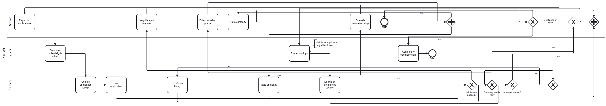
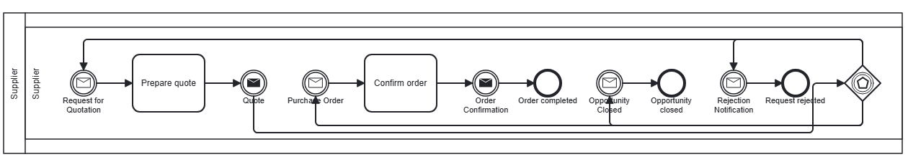
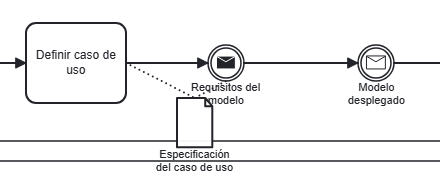
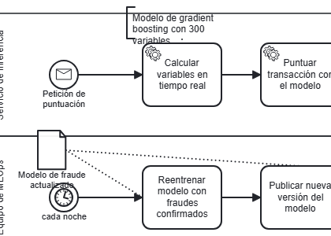
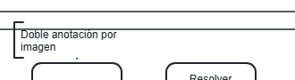
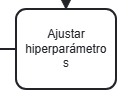
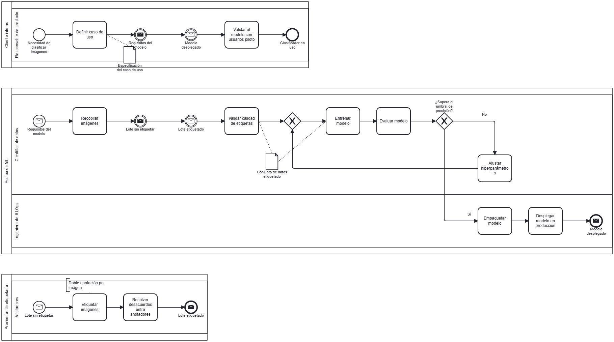
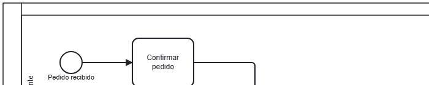
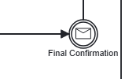

# Revisión visual del layout v6 y propuestas de mejora (2026-09-26)

Diagramas revisados: 7 del banco, renderizados con la skill tal como los recibe el usuario (layout por defecto v6, flujos de mensaje ocultos): `h-ml-01`, `h-ml-03`, `f-s-a3-find-a-job`, `c-syn010-chatgpt`, `c-syn015-gemini`, `f-canon-1-cheeseburger` y `f-es-almacen`. Se eligieron por variedad (1 a 3 pools, carriles, artefactos, bucles) y por tener las peores métricas de v6. Las cifras «en el banco» salen de `skill-runs/layout/v6-20260925-b56` (56 casos).

Lo que funciona bien: flujos lineales limpios (`c-syn010`, `almacen`), bandas de título despejadas (v4) y asociaciones cortas rectas (v6).

## Defectos observados

### 1. Gateways y ramas empujados al final del pool

`find-a-job`: todos los gateways terminan a la derecha y las aristas vuelven hacia la izquierda cruzando todo el diagrama (62 cruces).

`c-syn015-gemini`, pool Supplier: el gateway basado en eventos que sigue a «Quote» queda al final de la fila y sus tres ramas vuelven hacia atrás, por debajo y por encima de las etiquetas.

Causa probable: la asignación de columnas de `bpmn-auto-layout` con bucles y varios inicios por pool. En el banco, `longSeqEdges` es el defecto más frecuente (44/56 casos) y `crossings` afecta a 32.

### 2. Artefactos sin sitio: sobre bordes y cabeceras

`h-ml-01`: «Especificación del caso de uso» cae sobre el borde inferior del pool, con el nombre fuera, y su asociación tacha la etiqueta «Requisitos del modelo».

`h-ml-03`: la anotación sube a la franja superior del pool con el texto cortado sobre la tarea; «Modelo de fraude actualizado» tapa el evento temporizador «cada noche». Lo mismo en `h-ml-01` («Doble anotación por imagen»):

Patrón: cuando el carril es bajo, la búsqueda de sitio de v5/v6 no encuentra hueco dentro y el respaldo de v0 coloca el artefacto sobre los límites.

### 3. Palabras partidas dentro de las tareas

«hiperparámetro/s», «recommendati/on». Las tareas miden siempre 100 px; en el banco hay 13 tareas con una palabra de 14 letras o más (`recommendation` ×4, `Disembarkation`, `energéticamente`, `retrieval-augmented`…).

### 4. Pools de distinto ancho

Desde v1 cada pool mide lo que ocupa su contenido: 16 de los 20 casos con varios pools tienen una relación de anchos mayor que 1,2. La convención habitual es un ancho común.

### 5. Franjas vacías arriba y abajo de cada pool

Los carriles no llenan el pool: quedan 20 px arriba y abajo que parecen carriles vacíos. Ocurre en los 90 pools del banco y viene de v0 (TFM); hay que confirmar que no es un estilo buscado.

### 6. Etiquetas de eventos que tocan bordes o líneas

«Final Confirmation» (`c-syn010`) llega al borde del pool; en `h-ml-01` y `h-ml-03` las etiquetas de eventos quedan bajo asociaciones o artefactos. Enlaza con la idea del usuario de subir la etiqueta cuando abajo choca.

## Propuestas, por impacto y coste

| # | Propuesta | Defectos | Impacto | Coste | Métrica para aceptarla |
| --- | --- | --- | --- | --- | --- |
| A | **Capas por flujo en cada pool**: romper ciclos y asignar columnas por el camino más largo (Sugiyama), colocando cada gateway justo después de su predecesor | 1 | Alto | Alto | `longSeqEdges`, `crossings`, `forwardSeqRatio` |
| B | **Hacer sitio a los artefactos**: si no hay hueco válido en el carril, crecer el carril (y desplazar los siguientes) en lugar de usar el respaldo de v0 | 2 | Alto en casos con artefactos | Medio | `artifactTextOutsidePool`, `labelShapeOverlaps`, `clippedText` |
| C | **Artefactos, siguiente iteración** (del voto v5–v6): codos caros cerca + aire limitado por la distancia a su tarea; cohesión fuera o rediseñada | 2 | Medio | Bajo | `longAssociations`, `bentNearAssociations`, `assocLengthMean` |
| D | **Ancho de tarea según su palabra más larga**, fijado antes del auto-layout | 3 | Medio (13 tareas) | Medio | `clippedText` y una métrica nueva de palabras partidas |
| E | **Ancho común de pools**: extender cada pool y sus carriles hasta el borde derecho mayor | 4 | Medio en multi-pool | Bajo | `poolWidthCV` → 0, área (se acepta el crecimiento) |
| F | **Carriles que llenan el pool** (sin franjas vacías) | 5 | Bajo-medio (todos los diagramas) | Bajo | Inspección; altura |
| G | **Etiquetas de eventos arriba cuando abajo chocan** (idea del usuario) | 6 | Medio | Bajo-medio | `labelEdgeOverlaps`, `labelShapeOverlaps` |

## Propuesta añadida después de la revisión

H. **Etiquetas de flujo que chocan con la tarea de destino** (nota del usuario, 2026-09-26, al revisar `c-syn015-chatgpt`): «Critical risk», «No critical risk», «Above budget»… están bien situadas, pero hay que desplazarlas un poco a la izquierda según la longitud del texto. En v7 son 4 etiquetas sobre forma, todas en ese caso (`labelShapeOverlaps` en la vista entregada). Causa probable: `labels.ts` estima el ancho del texto (`CHAR_W = 6`) en lugar de medirlo. Arreglo propuesto: medir el texto y, si la caja toca la forma de destino, retroceder la etiqueta a lo largo de su segmento. Sin hacer.

Actualización (2026-09-26): el usuario pidió unir F a E (el primer y el último carril sin separación con la línea del pool). Hecho como candidato v7 (`evidence/layout-v7/REPORT.md`).

Orden sugerido: E y F (baratos, cambian todos los diagramas multi-pool), luego C o B (siguen la línea de artefactos ya votada), y A como proyecto aparte por riesgo y alcance. Una idea por candidato, con su ablación guardada en el repositorio.

Imágenes: recortes de los PNG entregados por la skill (`render-dsl`, v6, mensajes ocultos), sin retocar.
